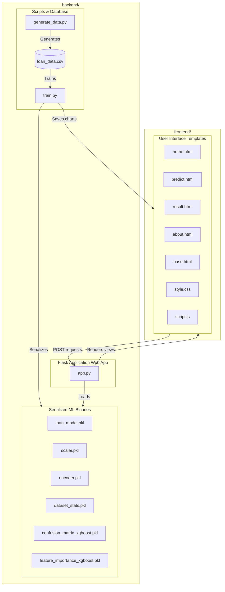

# Smart Lender – Loan Eligibility Prediction System

Smart Lender is an end-to-end Machine Learning web application designed to evaluate loan applicants' profiles and predict their credit eligibility in real-time. By leveraging historical lending parameters, preprocessing pipelines, class-balancing techniques, and robust classification models, it helps banking institutions and financial entities make informed, objective, and high-speed credit decisions.

---

## Folder Structure

The project is divided into segregated `frontend` and `backend` directories:



---

## How to Run the Project (Locally & in VS Code)

Follow these instructions to run the project from the root folder (`d:/smartbridge`):

### 1. Open the project in VS Code
- Start VS Code, click **File** $\rightarrow$ **Open Folder...**, and select the `d:/smartbridge` directory.
- Open the built-in terminal using `Ctrl` + `` ` `` (backtick) or `Cmd` + `` ` `` on macOS.

### 2. Activate the Virtual Environment
Activate the pre-configured `.venv` virtual environment in the terminal:
```powershell
# For Windows PowerShell (VS Code default on Windows)
.venv\Scripts\Activate.ps1

# For Command Prompt (cmd)
.venv\Scripts\activate.bat

# For Bash / Git Bash
source .venv/Scripts/activate
```

### 3. Generate the Synthetic Dataset
Run the data generator to create the CSV dataset:
```bash
python backend/scripts/generate_data.py
```

### 4. Execute ML Pipeline Training
Train the classification model, serialize files, and export charts to the frontend static folder:
```bash
python backend/scripts/train.py
```

### 5. Launch the Flask Web Server
Start the local development server:
```bash
python backend/app.py
```
After launching, open your browser and navigate to: **[http://127.0.0.1:5000](http://127.0.0.1:5000)**

---

## Technology Stack

* **Backend**: Python, Flask, Pickle
* **Machine Learning**: Scikit-Learn, XGBoost, Imbalanced-Learn (SMOTE)
* **Data Engineering**: Pandas, NumPy
* **Data Visualization**: Matplotlib, Seaborn
* **Frontend**: HTML5, CSS3, JavaScript, Bootstrap 5, FontAwesome
* **Deployment**: Gunicorn, Procfile compatibility

